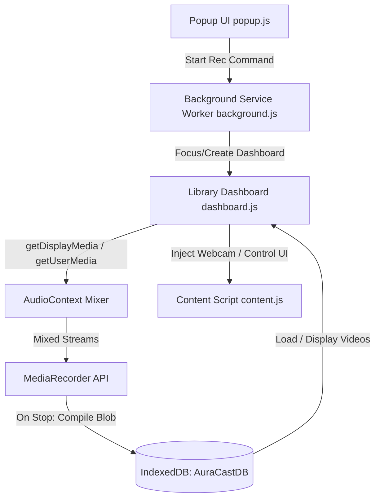

# DigitalGyan Broadcast 🎥

**DigitalGyan Broadcast** is a modern, lightweight, privacy-first Google Chrome Extension that allows users to record their screen and webcam simultaneously. With customizable circular webcam bubbles, Picture-in-Picture support, system & microphone audio mixing, and a local offline video library dashboard, it is the perfect tool for creating tutorials, online teaching presentations, and video memos.

---

## ✨ Key Features

- **Multiple Recording Modes:**
  - **Screen + Camera:** Record any desktop window, entire screen, or specific tab with a floating webcam overlay.
  - **Screen Only:** Capture clean screen recordings with or without audio.
  - **Camera Only:** Directly record from your webcam.
- **Floating Webcam Overlay Options:**
  - **In-Page Bubble:** A draggable, custom-styled circular webcam window injected into the active tab's page.
  - **Desktop PiP (Picture-in-Picture):** A true always-on-top, system-level floating webcam overlay that remains visible even when switching to other desktop applications.
- **Professional Audio Mixing:**
  - Mixes desktop/tab system audio and microphone inputs into a single audio track using the browser's native `AudioContext` API.
  - Support for custom microphone selection directly from the settings interface.
- **Offline Library Dashboard:**
  - **IndexedDB Storage:** Video data, thumbnails, durations, and metadata are saved locally on the user's disk (stored in a local database called `AuraCastDB`).
  - **Modal Video Player:** Play back your recorded clips directly in the library.
  - **Title Renaming:** Easily update the titles of your recorded clips.
  - **Exporting/Downloading:** Download recordings as standard high-quality `.webm` files.
  - **Disk Space Insights:** Live display showing estimated local storage consumption.
- **Privacy First:** 
  - Works 100% offline. Zero server-side uploads or tracking. Your video data never leaves your computer.

---

## 📁 File Structure

Here is an overview of the codebase files:

| File Name | Description |
| :--- | :--- |
| **`manifest.json`** | Defines extension version (Manifest V3), permissions (`storage`, `activeTab`, `scripting`, `tabs`), background scripts, content scripts, and web-accessible resources. |
| **`popup.html`** / **`popup.js`** / **`popup.css`** | The popup user interface when clicking the extension icon. Allows users to configure recording options, start recording, and navigate to the video library dashboard. |
| **`background.js`** | The core service worker that coordinates recording state, routes message signals between pages, and handles dynamic injection of webcam overlays. |
| **`content.js`** / **`content.css`** | Scripts injected into the target tab to display the interactive webcam bubble widget and screen controller bar overlay (Pause/Resume/Stop/Mute). |
| **`camera.html`** / **`camera.js`** / **`camera.css`** | Web-accessible iframe content used to safely render the live webcam stream within the in-page camera overlay bubble. |
| **`dashboard.html`** / **`dashboard.js`** / **`dashboard.css`** | The heart of the application: controls the media capture engine, records browser streams via `MediaRecorder` with WebM codecs, manages the IndexedDB database (`AuraCastDB`), and renders the local video library. |
| **`index.html`** | A user-friendly onboarding page detailing instructions on how to download the `.zip` archive package and load the extension unpacked. |
| **`icons/`** | Contains visual brand icons and assets used for Chrome Web Store branding, extension menus, and UI components. |

---

## 🛠️ Technical Architecture

### 1. Audio Mixing Setup
To capture system audio (e.g. video sound playing in the browser) and microphone voice recording simultaneously, `dashboard.js` uses a custom `AudioContext` pipeline:
- Tab audio from `getDisplayMedia` is sent to a `MediaStreamAudioSourceNode`.
- Mic audio from `getUserMedia` is sent to a separate `MediaStreamAudioSourceNode`.
- Both inputs are connected to a `MediaStreamAudioDestinationNode` to mix them, yielding a single track for recording.

### 2. Picture-in-Picture Webcam
To bypass standard browser iframe bounds, the "Desktop PiP" option uses the Document Picture-in-Picture or HTMLVideoElement PiP API to stream the user's camera feed into a small, floating native OS overlay window, letting users run presentations outside Chrome.

### 3. Local Storage (IndexedDB)
The extension implements a local store database:
- **Database Name:** `AuraCastDB`
- **Object Store:** `recordings`
- **Keys:** Auto-incremented IDs (`keyPath: 'id'`)
- Each video entry contains the video `Blob`, auto-generated Canvas frame JPEG `thumbnail`, recording `duration` (ms), `size` (bytes), `date` timestamp, and user-defined `title`.

---

## 🚀 Installation Guide (Developer / Unpacked Mode)

Since this extension runs locally, you can load it directly into Google Chrome as an unpacked extension:

1. **Download the Package:**
   - Download/clone this repository and extract the files into a local folder on your computer.
2. **Open Extensions Page:**
   - In Google Chrome, type and navigate to: `chrome://extensions/`
3. **Enable Developer Mode:**
   - Locate the **"Developer mode"** toggle switch in the top-right corner of the Extensions page and turn it **ON**.
4. **Load Unpacked Extension:**
   - Click the **"Load unpacked"** button in the top-left corner.
   - Select the directory folder containing this project (the folder containing the `manifest.json` file).
5. **Pin & Start Using:**
   - Click the puzzle piece icon in the browser toolbar, find **DigitalGyan Broadcast**, and pin it for quick access!

---

## 💻 Development & System Verification

- **Code standards:** Standard vanilla HTML5, CSS3, and ES6+ JavaScript modules. No build toolchain required!
- **Codecs used:** optimal `video/webm;codecs=vp9,opus` for Chrome (falls back to `vp8` or generic `webm` if unsupported).
- **Offline testing:** You can view the library by opening the dashboard directly at `chrome-extension://<EXTENSION_ID>/dashboard.html`.

---

⚖️ *Developed offline by @DigitalGyan12412. All rights reserved.*
